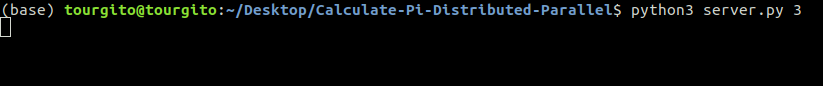
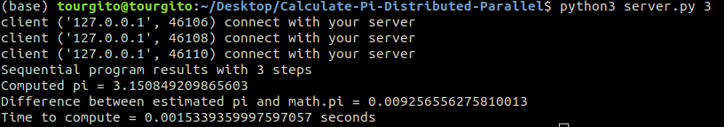
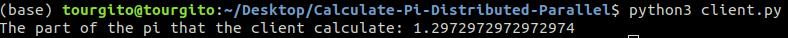
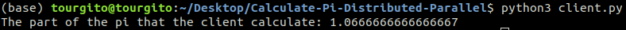
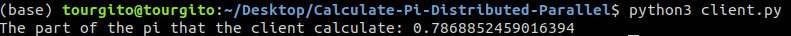

# Calculate-Pi-Distributed-Parallel

This is an example of calculating distributed and parallel the Pi. The calculation is implemented through a server and three clients. The communication of the server with the clients is implemented with sockets. The figure 1.1 shows the server, which is waiting the clients to connect with it. 

 <b>Figure 1.1 The server waits the clients to connect</b> 

Next, the figure 1.2 shows that the clients connected with the server and the results of the calculation.  

 <b>Figure 1.2 The clients connected to the server and calculated the Pi</b> 

In figure 1.2 at the three firts lines shows up the connection of each client with the server. At the fifth line shows up the Pi that the clients calculated. At the last line shows up the time that the clients needed to calculate the Pi. 

The figures 1.3, 1.4 and 1.5 show the part of the Pi that each of the three clients calculated. 

 <b>Figure 1.3 The part of the Pi that the first client calculated</b> 

 <b>Figure 1.4 The part of the Pi that the second client calculated</b> 

 <b>Figure 1.5 The part of the Pi that the third client calculated</b> 
